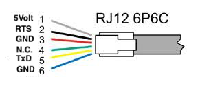

## Vragen en Antwoorden

### Niet alles DSMR 4 is DSMR 4 ..

Mijn DSMR-logger doet het niet als ik hem op de Slimme Meter aansluit

Er zijn Slimme Meters die 'zeggen' DSMR Versie 4
te volgen maar toch geen 5 volt met voldoende stroom leveren.
 Bouwers van de DSMR-logger hebben problemen gemeld met de <i><b>KAIFA</b> MA105A</i> en 
<i>MA105C</i> en met de <i><b>KAIFA</b> MA304</i>.
 Kijk bijvoorbeeld
<a href="https://willem.aandewiel.nl/index.php/2018/08/28/slimme-meter-uitlezer/#comment-368" target="_blank">
hier</a> en
<a href="https://willem.aandewiel.nl/index.php/2018/08/28/slimme-meter-uitlezer/#comment-334" target="_blank">
hier</a>.
 
 Dit probleem is op te lossen door de DSMR-logger op een externe (bijvoorbeeld USB) voeding
aan te sluiten.

### 5 Volt Programmer

Kan ik met een 5 volt USB to TTL adaptor de DSMR-logger flashen?

Als het een type is dat de TX en RX signalen op 3v3 levert (bijvoorbeeld 
<a href="https://opencircuit.nl/Product/12809/USB-to-TTL-Serial-Cable-Debug-Console-Cable-for-Raspberry-Pi" target="_blank">
deze</a>)
dan kán het wel, maar moet je de 5 Volt output op de 5 Volt pin van de DSMR-logger aansluiten.
Je moet hem dan zoals in het plaatje hieronder aansluiten.

  

### Tactile Switches

Waarom heb ik een tacktile switch met een lange en één met een korte stift?

De tacktile switch met de korte stift is de RESET switch. 
Eenmaal ingebouwd in een (project) box moet de FLASH switch bereikbaar blijven omdat hij
een dubbel functie heeft. 
Hij dient bij normaal gebruik om het oled-scherm 'wakker' te maken.
Vandaar de lange stift!
 
Deze lange stift maakt de switch wel erg kwetsbaar zolang de DSMR-logger niet in een (project) box
is ingebouwd. Als je er een niet <i><b>recht-naar-beneden</b></i> kracht op uitoefend, dan 
breekt hij makkelijk af!

### PUYA Chip

Mijn versie 3 bordje met PUYA chip doet het niet

Het heeft er alle schijn van dat de DSMRloggerWS firmware niet geschikt is voor
een ESP-01 (versie 3 bordje) met een PUYA flash chip.

Kijk ook <a href="../PUYA_patch/">hier</a>.

 

[RJ12 (6P6C)]
 

  

 
