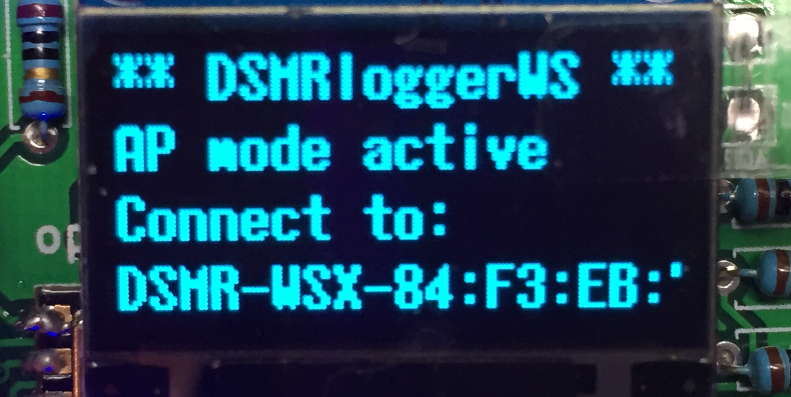

## Slimme Meter Pré DSMR 4.0

Vanaf versie 0.4.5 kan de DSMRloggerWS firmware ook overweg met Slimme Meters
die zich niet aan de DSMR 4.0 standaard conformeren.

<div class="admonition note">
<p class="admonition-title">Let op!  Deze functionaliteit is slechts beperkt getest!</p>
Met dank aan <i>Jordy</i> voor het testen!
<br>
<br>Mocht je meer informatie kunnen geven over eventuele
problemen neem dan contact met mij op (plaats een comment op mijn website)

</div>

Om de DSMRloggerWS firmware geschikt te maken voor een pré DSMR 4.0 Slimme 
Meter zijn er een aantal opties mogelijk.

<table>
<tr>
<th align="left">Define</th><th align="left">Functie</th>
</tr><tr>
<td style="vertical-align:top">USE_PRE40_PROTOCOL</td><td>Deze define zorgt ervoor dat de instellingen 
<br>voor de seriële poort goed worden gezet (9600, SERIAL_7E1).
<br>tevens wordt een speciaal gehackte 'arduino-dsmr' bibliotheek
<br>gebruikt omdat het pré DSMR 4.0 protocol geen checksum heeft.</td>
</tr><tr>
<td style="vertical-align:top">USE_NTP_TIME</td><td>Het pré DSMR 4.0 protocol geeft niet altijd een timestamp (0-0:1.0.0).
<br>Doet jouw Slimme Meter dat ook niet, dan wordt met deze define de tijd
<br>via het NTP protocol gebruikt. Vooralsnog alleen Winter Tijd!</td>
</tr><tr>
<td style="vertical-align:top">SM_HAS_NO_FASE_INFO</td><td>Heb je een Slimme Meter die geen verbruik per fase (1-0:21.7.0 enz.)
<br>door geeft, dan kun je met deze optie er toch voor zorgen dat de <i>Actuele</i> 
<br>chart informatie geeft over je verbruik</td>
</tr>
</table>


```
/******************** compiler options  ********************************************/
#define IS_ESP12                  // define if it's a 'bare' ESP-12 (no reset/flash functionality on board)
#define USE_UPDATE_SERVER         // define if updateServer to be used and there is enough memory
#define HAS_OLED_SSD1306          // define if an OLED display is present
//  #define USE_PRE40_PROTOCOL        // define if Slimme Meter is pre DSMR 4.0 (2.2 .. 3.0)
//  #define USE_NTP_TIME              // define to generate Timestamp from NTP (Only Winter Time for now)
//  #define SM_HAS_NO_FASE_INFO       // if your SM does not give fase info use total delevered/returned
//  #define SHOW_PSK_KEY              // well .. show the PSK key, what else?
//  #define HAS_NO_METER              // define if No "Slimme Meter" is attached (*TESTING*)
/******************** don't change anything below this comment **********************/
```

Om deze functionaliteit te kunnen gebruiken moet je ook de speciaal gehackte 
<a href="https://github.com/mrWheel/arduino-dsmr30" target="_blank">
arduino-dsmr30</a> bibliotheek installeren!

<br>

---
<center  style="font-size: 70%">[DSMRlogger AP Mode]</center><br>
<center></center>

