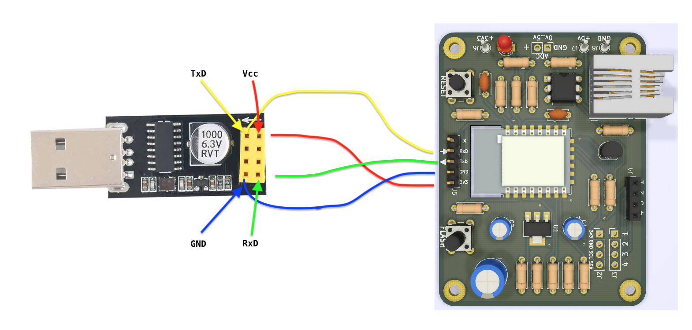
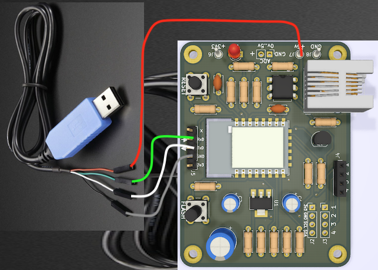

## Programmer voor de DSMR-logger V4

Er zijn verschillende manieren om de DSMR-logger van (nieuwe) firmware
te voorzien. Dit gaat het eenvoudigst *Over The Air* (OTA) maar de
eerste keer zal dit altijd bedraad moeten.

* [FDTI-adapter](#fdti-adaptor)
* [USB to Serial adaptor bordje](#usb-to-serial-adaptor-bordje)
* [USB to TTL adaptor kabel](#usb-to-ttl-serial-adaptor-kabel)
* [Flashen (programmeren)](#flashen-programmeren)

### FDTI-adapter
Je kunt hiervoor een 
<a href="https://www.sparkfun.com/products/9716" target="_blank">
FDTI-adapteri</a>
gebruiken als je er maar voor zorgt dat *Vcc*  **3v3** (dit
kun je aan de onderkant van het bordje via een soldeer brug instellen) is!

Je moet de volgende verbindingen maken:

| Programmer | DSMR-logger | Opmerking |
|:----------:|:-----------:|:----------|
| Vcc | Vcc | LET OP! **3v3** |
| GND | GND ||
| TxD | RxD ||
| RxD | TxD ||

### USB to Serial adaptor bordje
Ook een 
<a href="https://opencircuit.nl/Product/11544/ESP-01-USB-Adapter" target="_blank">
USB-to-Serial adapter</a>
is eenvoudig als programmer te gebruiken
door met vier draadjes verbinding tussen de USB-to-Serial Adapter en 
de *DSMR-logger v4* te maken volgens onderstaand schema:

### USB to TTL Serial adaptor kabel
Ook 
<a href="https://opencircuit.nl/Product/12809/USB-to-TTL-Serial-Cable-Debug-Console-Cable-for-Raspberry-Pi" target="_blank">
deze</a>
USB-to-Serial kabel is eenvoudig als programmer te gebruiken alleen moet je er 
rekening mee houden dat de geleverde spanning <b>5 volt</b> is en je deze dus
niet op de programming poort van de DSMR-logger V4 mag aansluiten.   
Sluit de USB-to-Serial kabel op deze manier aan om zonder problemen de
DSMR-logger V4 te kunnen programmeren.

### Flashen (programmeren)
Omdat de DSMR-logger V4 geen aansluitingen voor specifieke controle signalen heeft
moet je in de ArduinoIDE aangeven dat je bij het uploaden
van firmware of de `data`-map geen speciaal protocol gebruikt.
In het `Tools`-menu geef je bij `Reset Method` ***None*** op.

Om nu de firmware of de `data`-map naar de *DSMR-logger v4* te flashen
moet je de *DSMR-logger v4* ***eerst*** in `Flash-mode` zetten.

Let op!

Koppel, vóórdat je de programmer op de <i>DSMR-logger v4</i> aansluit, éérst
de <i>Slimme Meter</i> los!

Dit doe je door achtereenvolgens deze handelingen uit te voeren:

1. Druk op de `FLASH` knop en houdt deze ingedrukt
2. Druk vervolgens op de `RESET` knop
3. Laat de `RESET` knop los
4. Laat als laatste de `FLASH` knop los

De DSMR-logger staat nu in `Flash-mode`  en blijft in die mode tot er firmware
of de inhoud van de `data`-map wordt ge-upload (of tot je nog een keer op de
`RESET` knop drukt).

Hierna hoort de DSMR-logger normaal op te starten. Mocht dit niet het geval zijn
druk dan 1x op de `RESET` knop..

Zie ook [`Vraag en Antwoord`](QenA.md#5-volt-programmer)

 

---

[ChartActueel]

