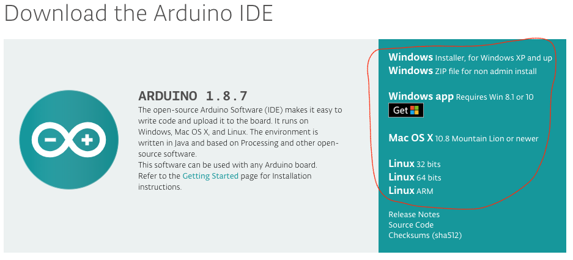
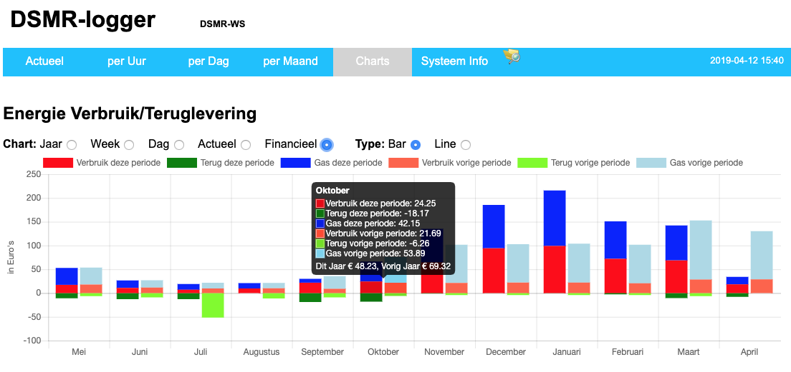

## Installatie ArduinoIDE
Download en installeer de Arduino Integrated Development Environment (IDE) 
voor het Operating Systeem (OS) waar jouw Desktop of Laptop computer (er 
zijn versies voor Windows, Linux en Mac) mee werkt.   
Je kunt de Software 
<a href="https://www.arduino.cc/en/Main/Software" target="_blank">
hier</a> downloaden.

Let op!

De DSMRloggerWS firmware is getest met de ArduinoIDE v1.8.8, v1.8.9 en v1.8.10

Let op!

De Arduino IDE v1.9.x (Beta) is NIET geschikt om deze firmware mee te compileren.
 
Tot v1.9.x zorgt de IDE ervoor dat alle tab-bladen (<b>.ino</b> files) achter elkaar
worden geplakt tot één source file waarna deze aan de compiler (als één file dus)
wordt aangeboden. De Arduino IDE is eigenlijk de enige IDE (voor zover ik weet)
die dit doet en is als zodanig dus een beetje <i>vreemd</i>. 
 
v1.9.x (Beta) doet dit in ieder geval (nog).

Na het downloaden moet je het ontvangen bestand uitpakken (unzip of untar) 
en installeren. Dat installeren is per OS anders maar staat duidelijk op de 
website van Arduino aangegeven. Eenmaal geïnstalleerd kun je direct met de 
Arduino IDE aan de slag.

Om de IDE met de ESP8266 microprocessor te kunnen gebruiken moeten we nog 
wat stappen uitvoeren.

 

---

[DSMR-Chart Financieel]
 

