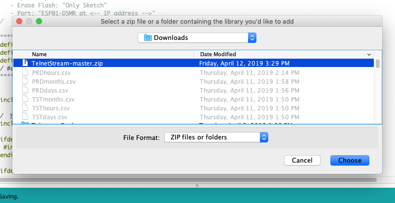

## Installatie Bibliotheken

Nu je een ArduinoIDE hebt waarmee je ESP8266’s kunt programmeren (flashen) zul je 
ontdekken dat er door briljante mensen software is ontwikkeld die je kunt 
gebruiken om complexe projecten te realiseren, zonder dat je zelf het wiel 
hoeft uit te vinden.

Deze software wordt veelal in de vorm van een bibliotheek aangeboden en je 
hoeft zo’n bibliotheek alleen maar te installeren om er gebruik van te kunnen maken.

Bijvoorbeeld een bibliotheek om je ESP8266 van een telnet server te voorzien (met 
een telnet server kun je via een telnet-client op je DeskTop of LapTop inloggen op 
je ESP8266). Er blijken hier een aantal bibliotheken voor te bestaan. 

Als voorbeeld nemen we *TelnetStream* van *Jan Drassy*. Na wat Googelen vinden we de 
software op [deze](https://github.com/jandrassy/TelnetStream/) 
(https://github.com/jandrassy/TelnetStream/) github pagina. 

Om de bibliotheek te installeren klik je op de groene download knop en 
selecteer je [Download ZIP].

Onthou waar je het zip-file bewaard.

Ga nu naar de ArduinoIDE en selecteer [`Sketch`] => [`Include Library`] => [`Add .ZIP Library`]

Er verschijnt een selectie window waar je het zojuist ge-download-de bestand selecteert.

De bibliotheek is nu geïnstalleerd en klaar om gebruikt te worden. De meeste 
bibliotheken komen met een aantal voorbeeld programma’s waarmee je kunt leren 
hoe je de bibliotheek kunt gebruiken.

Jan Drassy is erg summier met zijn uitleg maar gelukkig is 
er een map met voorbeelden (nou ja, één voorbeeld). 

(sorry, het plaatje is een beetje verknipt)

Klik je nu op [`TelnetStreamTest`] dan wordt dit voorbeeld programma 
in de ArduinoIDE geladen.

---
Installeer op dezelfde manier de bibliotheken die in het [vorige hoofdstuk](benodigdeBibliotheken.md)
zijn genoemd.

---
[ScreenShot]

