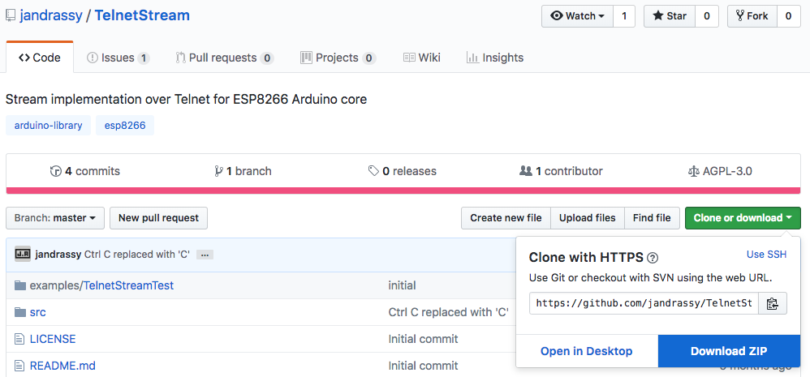
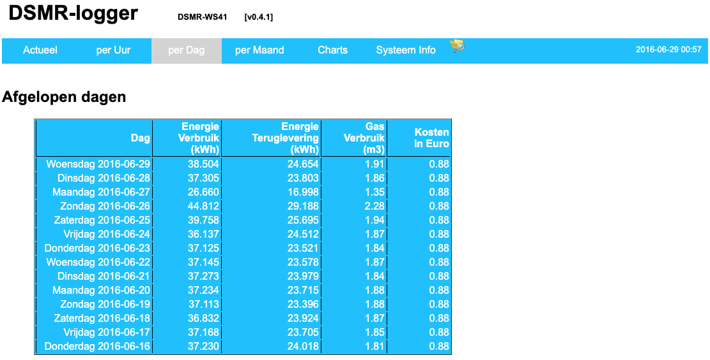

## Installatie Bibliotheken
Nu je een ArduinoIDE hebt waarmee je ESP8266’s kunt programmeren (flashen) zul je 
ontdekken dat er door briljante mensen software is ontwikkeld die je kunt 
gebruiken om complexe projecten te realiseren, zonder dat je zelf het wiel 
hoeft uit te vinden.

Deze software wordt veelal in de vorm van een bibliotheek aangeboden en je 
hoeft zo’n bibliotheek alleen maar te installeren om er gebruik van te kunnen maken.

<a href="https://www.arduino.cc/en/guide/libraries" target="_blank">
Hier</a>
vind je de officiële instructies
voor het installeren van bibliotheken met de ArduinoIDE.

Stel je wilt je ESP8266 benaderen met een `telnet client` zodat je vanaf
je Desktop of Laptop op de ESP8266 kunt inloggen.
Je hebt op de ESP8266 dan een `telnet server` nodig.
Met wat *Googelen* naar "*ESP8266 telnet*" blijken hier een aantal 
bibliotheken voor te bestaan. 

Als voorbeeld nemen we *TelnetStream* van *Jan Drassy*. Zijn telnet implementatie
kun je vanaf deze
<a href="https://github.com/jandrassy/TelnetStream/" target="_blanl">
https://github.com/jandrassy/TelnetStream/</a>
github pagina als bibliotheek downloaden. 

Om de bibliotheek te installeren klik je op de groene 
[Clone or download]
knop en selecteer je 
[Download ZIP].

Onthou waar je het zip-file bewaard!

Ga nu naar de ArduinoIDE en selecteer:

[`Sketch`] => [`Include Library`] => [`Add .ZIP Library`]

Er verschijnt een selectie window waar je het zojuist ge-download-de bestand selecteert.

Klik op [Choose].

De bibliotheek is nu geïnstalleerd en klaar om gebruikt te worden. De meeste 
bibliotheken komen met een aantal voorbeeld programma’s waarmee je kunt leren 
hoe je de bibliotheek kunt gebruiken.

Jan Drassy is erg summier met zijn uitleg maar gelukkig is 
er een map met voorbeelden (nou ja, één voorbeeld). 

(sorry, het plaatje is een beetje verknipt)

Klik je nu op [`TelnetStreamTest`] dan wordt dit voorbeeld programma 
in de ArduinoIDE geladen.

---
Installeer op dezelfde manier de bibliotheken die voor de
`DSMRloggerWS` firmware nodig zijn
(zie het [volgende hoofdstuk](benodigdeBibliotheken.md)).

 

---

[DSMR-Dag]
 

