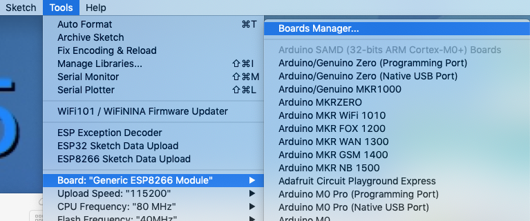
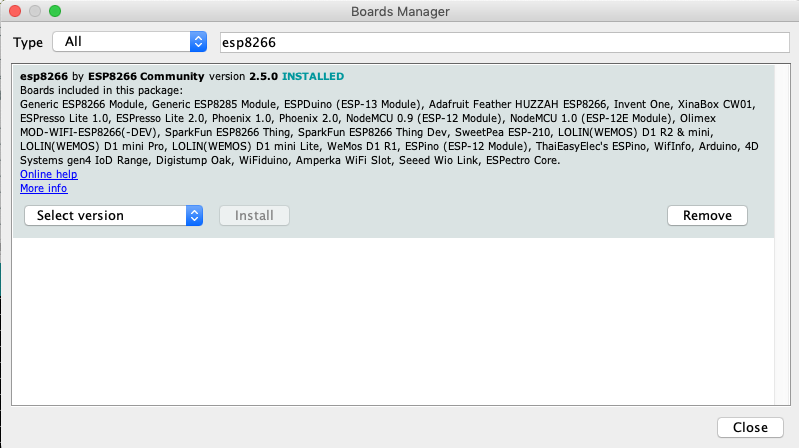
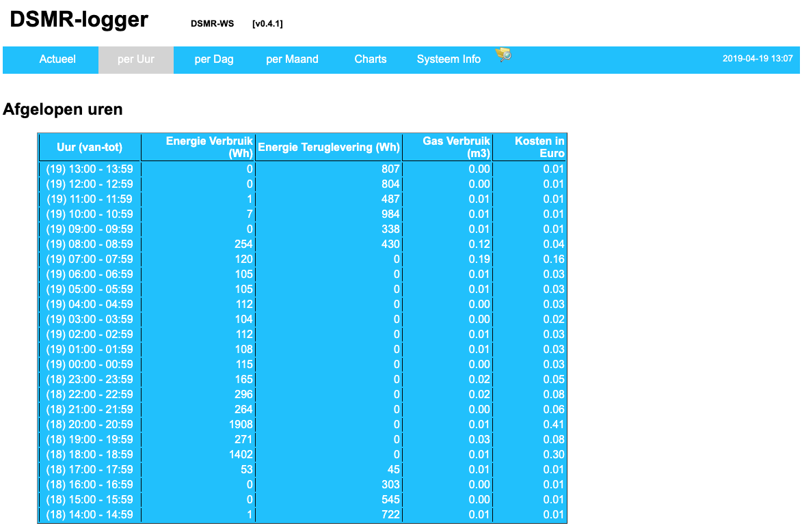

## Installatie ESP8266 core
In de Arduino IDE moet bij “Instellingen” de volgende URL worden ingevoerd 
achter “*Additional Boards Manager URL’s:*” (zie rood omlijnde kader)

`http://arduino.esp8266.com/stable/package_esp8266com_index.json`

Lees vooral de uitleg in het 
<a href="https://github.com/esp8266/Arduino/blob/master/README.md" target="_blank">
`README.md`</a>
bestand en de uitgebreide 
<a href="https://arduino-esp8266.readthedocs.io/en/2.5.0/" target="_blank">
`documentatie`</a>
op hun website!

Er kunnen meer additional board manager URL’s worden ingevuld. Je moet ze dan 
achter elkaar zetten en scheiden door een komma (**,**).

Eventueel kun je ook het pad waar je projecten staan (de `Sketchbook Location`) 
aanpassen. Standaard verwijst deze naar je `Documenten` map:

`C:\Users\<YourLoginName>\Documents\arduino\`

.. en dat is een prima plek!

De andere instellingen kun je naar behoefte aanpassen. Hierboven staan de 
instellingen die ik prettig vind. 

Na het maken van aanpassingen klik je op [OK].

Ga nu via de ArduinoIDE menu-balk naar
[`Tools`] -> [`Board`] -> [`Boards Manager`]. 

Voer bij filter “esp8266” in. 

Selecteer de versie die je wilt gaan gebruiken en klik op [`Install`].

Let op!

De DSMRloggerWS firmware is getest met <b>versie 2.5.0</b>.

 

---

[DSMR-Uur]
 

