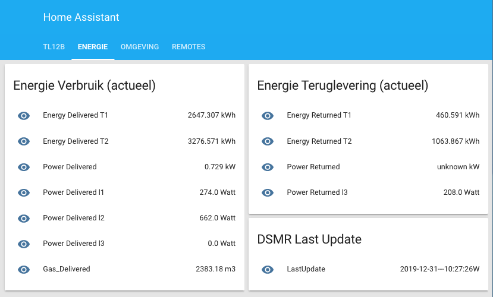

## Integratie DSMR-logger met Home Assistant

De data uit de DSMR-logger kan op verschillende manieren met
Home Assistant gedeeld worden. Verreweg het makkelijkste is dat
door gebruik te maken van een MQTT Broker.
De DSMR-logger publiceert de gegevens uit de Slimme Meter in een
bepaald topic. Home Assistant moet dan een subscription op dat
zelfde topic hebben om zo de gegevens in te lezen en te presenteren.

Vaak draait Home Assistant thuis op een server (Raspberry Pi
of anderszins) en is het eenvoudig om op die server ook een
(Mosquitto) MQTT broker te installeren (veel installaties van
Home Assistant hebben dat al standaard gedaan). 

Om de intergratie voor elkaar te krijgen moet in het `configuratie.yaml` 
bestand van Home Assistant onder andere deze instellingen
komen te staan:

```
group:  !include_dir_merge_named groups/
script: !include scripts.yaml
sensor: !include_dir_merge_list sensors/
switch: !include_dir_merge_list switches/
light:  !include_dir_merge_list lights/
camera: !include_dir_merge_list cameras/

mqtt:
  broker: <ip-adres-MQTT-broker>
  port: 1883
  client_id: HassIO
  keepalive: 60
  username: <user name>
  password: <password>

```

Hierdoor zal Home Assistant alle (yaml) bestanden die in de sub-map
`groups/` staan inlezen. Hetzelfde geldt voor de sub-mappen
`sensors/`, `switches/`, `lights/` en `cameras/`.

Voor de koppeling met de DSMR-logger zijn alleen de sub-mappen
`groups/` en `sensors/` van belang en natuurlijk de settings
voor de `MQTT broker`!

In de sub-map `groups/` komt een bestand `DSMR-Actueel.yaml` met 
de volgende inhoud:
```
###group: ###
###VIEWS###

Energie:
  name: Energie
  view: yes
  entities:
    - group.Energie_Verbruik
    - group.Energie_Teruglevering
    - group.DSMR_Last_Update
    - group.Energy_Graph1
    - group.LastUpdate

###CARDS###
DSMR_Last_Update:
  name: DSMR Last Update
  entities:
    - sensor.LastUpdate

Energie_Verbruik:
  name: Energie Verbruik (actueel)
  entities:
    - sensor.Energy_Delivered
    - sensor.Power_Delivered
    - sensor.Power_Delivered_l1
    - sensor.Power_Delivered_l2
    - sensor.Power_Delivered_l3
    - sensor.Gas_Delivered

Energie_Teruglevering:
  name: Energie Teruglevering (actueel)
  entities:
    - sensor.Energy_Returned
    - sensor.Power_Returned
    - sensor.Power_Returned_l3

```

en in de sub-map `sensors/` komt een bestand `DSMR-Actueel.yaml`
met deze inhoud:
```
### sensor: ###
### DSMR-WS ###

- platform: mqtt
  name: "LastUpdate"
  friendly_name: "Last update"
  state_topic: "DSMR-WS/JSON/Energy"
  unit_of_measurement: ""
  value_template: "[[ value_json.DT ]]"

- platform: mqtt
  name: "Energy Delivered"
  state_topic: "DSMR-WS/JSON/Energy" 
  unit_of_measurement: "kWh"
  value_template: '[[ value_json.ED | round(3) ]]'

- platform: mqtt
  name: "Energy Returned"
  state_topic: "DSMR-WS/JSON/Energy" 
  unit_of_measurement: "kWh"
  value_template: '[[ value_json.ER | round(3) ]]'

- platform: mqtt
  name: "Power Delivered"
  state_topic: "DSMR-WS/JSON/Power" 
  unit_of_measurement: "Watt"
  value_template: '[[ value_json.PDt | round(1) ]]'

- platform: mqtt
  name: "Power Returned"
  state_topic: "DSMR-WS/JSON/Power"
  unit_of_measurement: "Watt"
  value_template: '[[ value_json.PRt| round(1) ]]'

- platform: mqtt
  name: "Power Delivered l1"
  state_topic: "DSMR-WS/JSON/Power" 
  unit_of_measurement: "Watt"
  value_template: '[[ value_json.PDl1 | round(1) ]]'

- platform: mqtt
  name: "Power Delivered l2"
  state_topic: "DSMR-WS/JSON/Power" 
  unit_of_measurement: "Watt"
  value_template: '[[ value_json.PDl2 | round(1) ]]'

- platform: mqtt
  name: "Power Delivered l3"
  state_topic: "DSMR-WS/JSON/Power" 
  unit_of_measurement: "Watt"
  value_template: '[[ value_json.PDl3 | round(1) ]]'

- platform: mqtt
  name: "Power Returned l1"
  state_topic: "DSMR-WS/JSON/Power"
  unit_of_measurement: "Watt"
  value_template: '[[ value_json.PRl1 | round(1) ]]'

- platform: mqtt
  name: "Power Returned l2"
  state_topic: "DSMR-WS/JSON/Power"
  unit_of_measurement: "Watt"
  value_template: '[[ value_json.PRl2 | round(1) ]]'

- platform: mqtt
  name: "Power Returned l3"
  state_topic: "DSMR-WS/JSON/Power"
  unit_of_measurement: "Watt"
  value_template: '[[ value_json.PRl3 | round(1) ]]'

- platform: mqtt
  name: "Gas_Delivered"
  state_topic: "DSMR-WS/JSON/Energy"
  unit_of_measurement: "m3"
  value_template: '[[ value_json.GD | round(2) ]]'

```
<div class="admonition note">
<p class="admonition-title">Let op!</p>
github pages kan niet tegen dubbele '<b>{</b>' tekens omdat hij dan denkt
dat er een variabele moet worden gesubstitueerd. Daarom heb ik
in bovenstaande source bij de <b>value_template</b>'s dubbele
 '<b>[</b>' en '<b>]</b>' gezet waar dit dus
dubbele '<b>{</b>' en '<b>}</b>' moeten zijn!!!
</div>




<hr>


