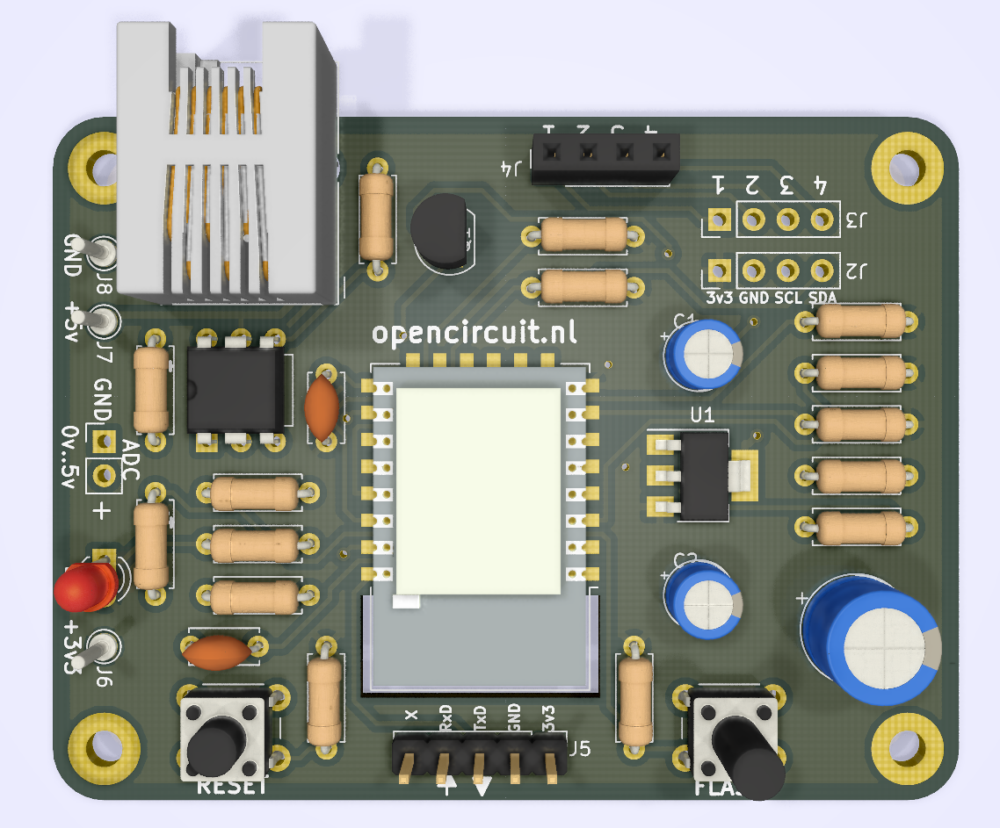

## upload Data map naar DSMR-logger V4 board

Zorg dat de `Serial Monitor` is afgesloten.

1.  Sluit de programmer aan op de DSMR-logger. 
2.  Druk op de `FLASH` knop en houdt deze ingedrukt. 
3.  Druk vervolgens de `RESET` knop in en laat deze weer los. 
4.  Laat nu ook de `FLASH` knop los.

De DSMR-logger staat nu in "Flash-mode" en wacht (geduldig) tot de inhoud van de `data` map
wordt opgestuurd.

- Ga in de Arduino IDE naar `Tools` ** -> ** `ESP8266 Sketch Data Upload`

SPIFFS wordt nu leeg gemaakt en alle bestanden in de `data` map worden naar 
het SPIFFS overgezet.

Hierna zal de DSMR-logger normaal opstarten, maar met de nieuw 
SPIFFS inhoud.

Let op!

Hou er rekening mee dat eventuele data-bestanden die al op SPIFFS stonden nu 
weg zijn! Als je ze niet kwijt wil moet je er eerst een kopie van maken op je
computer en deze, na het flashen van SPIFFS weer terug zetten (dat kan
met de DSMR-logger FSexplorer !

 

---

[ScreenShot PCB V4]
 

