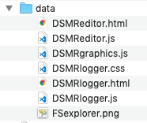
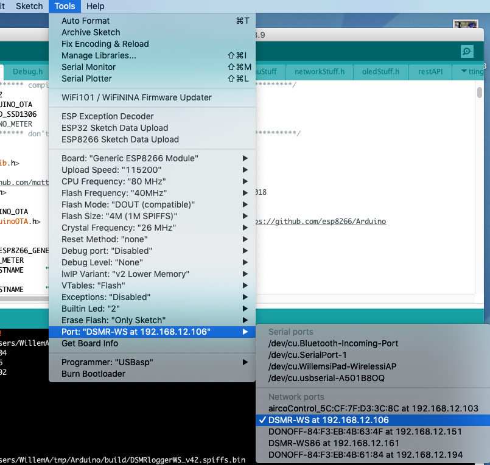
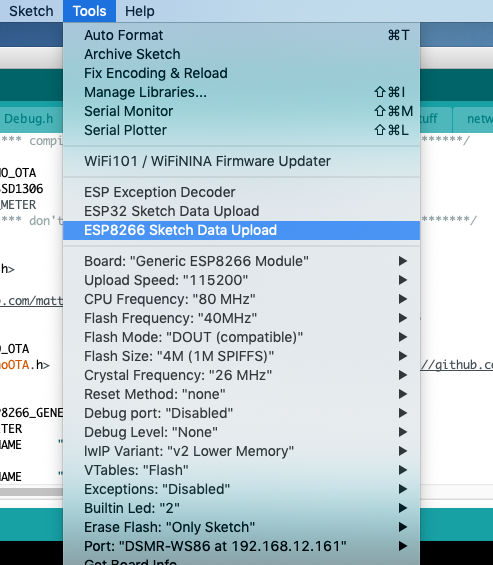

## upload Data map naar DSMR-logger V4 board

In de `data`-map van de DSMRloggerWS firmware staan bestanden die
nodig zijn voor het functioneren van de firmware.

Deze bestanden moeten dan ook overgezet worden naar de DSMR-logger. 
Dat 'overzetten' kan op twee manieren: *'[Bedraad](#bedraad)'* en *'[Over The Air](#over-the-air)'*

### Bedraad

Let op!

Zorg dat de <b>Serial Monitor</b> is afgesloten!

Pas op!

Koppel de DSMR-logger los van de <i>Slimme Meter</i> vóórdat je de DSMR-logger
op de programmer aansluit!!

1.  Sluit de programmer aan op de *DSMR-logger v4*. 
2.  Druk op de `FLASH` knop en houdt deze ingedrukt. 
3.  Druk vervolgens de `RESET` knop in en laat deze weer los. 
4.  Laat nu ook de `FLASH` knop los.

De *DSMR-logger v4* staat nu in "Flash-mode" en wacht (geduldig) 
tot de inhoud van de `data` map wordt opgestuurd.

- Ga in de Arduino IDE naar `Tools` ** -> ** `ESP8266 Sketch Data Upload`

SPIFFS wordt nu leeg gemaakt en alle bestanden in de `data` map worden naar 
het SPIFFS overgezet.

Hierna zal de DSMR-logger normaal opstarten, maar met de nieuw 
SPIFFS inhoud.

Let op!

Hou er rekening mee dat eventuele data-bestanden die al op SPIFFS stonden nu 
weg zijn! Als je ze niet kwijt wil moet je er eerst een kopie van maken op je
computer en deze, na het flashen van SPIFFS weer terug zetten (dat kan
met de DSMR-logger FSexplorer )!

### Over The Air
Bij het *Over The Air* uploaden van de bestanden uit de `data`-map kan de
`DSMRlogger v4` gewoon aan de Slimme Meter gekoppeld blijven.

Let op!

Zorg dat de <b>Serial Monitor</b> is afgesloten!

Alle `Board` gegevens blijven gelijk alleen selecteer je geen `Serial Port`
maar een `Network Port`

Start vervolgens het `ESP8266 Sketch Data Upload`-tool

Als alle bestanden naar het SPIFFS zijn overgezet zal de DSMR-logger opnieuw 
opstarten, maar met de nieuwe bestanden.

Let op!

Hou er rekening mee dat eventuele data-bestanden die al op SPIFFS stonden nu  
weg zijn! Als je ze niet kwijt wil moet je er eerst een kopie van maken op je
computer en deze, na het flashen van SPIFFS weer terug zetten (dat kan 
met de DSMR-logger FSexplorer )!

 

---

[PCB V4]
 

