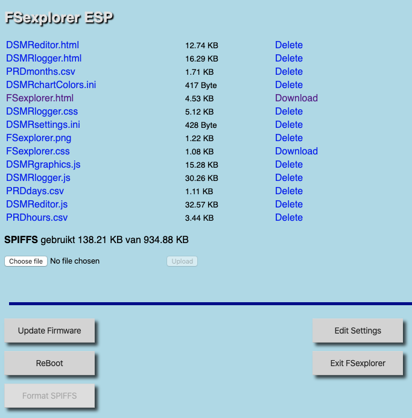

## upload Data map naar DSMR-logger V4 board

In de `data`-map van de DSMRloggerWS firmware staan bestanden die
nodig zijn voor het functioneren van de firmware.


Deze bestanden moeten dan ook overgezet worden naar de DSMR-logger. 
Dat 'overzetten' kan op twee manieren: *'[Bedraad](#bedraad)'* en *'[Over The Air](#over-the-air)'*

<hr>
### Bedraad
<div class="admonition note">
<p class="admonition-title">Let op!</p>
Zorg dat de <b>Serial Monitor</b> is afgesloten!
</div>

<div class="admonition note">
<p class="admonition-title">Pas op!</p>
Koppel de DSMR-logger los van de <i>Slimme Meter</i> vóórdat je de DSMR-logger
op de programmer aansluit!!
</div>


1.  Sluit de programmer aan op de *DSMR-logger v4*. 
2.  Druk op de `FLASH` knop en houdt deze ingedrukt. 
3.  Druk vervolgens de `RESET` knop in en laat deze weer los. 
4.  Laat nu ook de `FLASH` knop los.

De *DSMR-logger v4* staat nu in "Flash-mode" en wacht (geduldig) 
tot de inhoud van de `data` map wordt opgestuurd.

- Ga in de Arduino IDE naar `Tools` ** -> ** `ESP8266 Sketch Data Upload`

SPIFFS wordt nu leeg gemaakt en alle bestanden in de `data` map worden naar 
het SPIFFS overgezet.

Hierna zal de DSMR-logger normaal opstarten, maar met de nieuw 
SPIFFS inhoud.

<div class="admonition note">
<p class="admonition-title">Let op!</p>
Hou er rekening mee dat eventuele data-bestanden die al op SPIFFS stonden nu 
weg zijn! Als je ze niet kwijt wil moet je er eerst een kopie van maken op je
computer en deze, na het flashen van SPIFFS weer terug zetten (dat kan
met de DSMR-logger FSexplorer )!
</div>

<hr>
### Over The Air
Bij het *Over The Air* uploaden van de bestanden uit de `data`-map kan de
`DSMRlogger v4` gewoon aan de Slimme Meter gekoppeld blijven.
<div class="admonition note">
<p class="admonition-title">Aanbeveling</p>
zorg dat je het build-path in het <b>preferences.txt</b> bestand 
hebt aangepast!
<br/>
Kijk <a href="../preferencesIDE/">hier</a> hoe je dat kunt doen.
</div>

Alle `Board` gegevens blijven gelijk alleen selecteer je een `Serial Port`
die **nergens op is aangesloten**!

Start vervolgens het `ESP8266 Sketch Data Upload`-tool


Omdat je een `Serial Port` hebt geselecteerd waar niets op is aangesloten 
zal deze opdracht met een foutmelding eindigen.   
Ondertussen is er wél een `.spiffs.bin` bestand in het `build-path` neergezet.


<div class="admonition note">
<p class="admonition-title">Let op!</p>
Hou er rekening mee dat eventuele data-bestanden die al op SPIFFS stonden nu  
weg zijn! Als je ze niet kwijt wil moet je er eerst een kopie van maken op je
computer en deze, na het flashen van SPIFFS weer terug zetten (dat kan 
met de DSMR-logger FSexplorer )!
</div>

Klik nu op de DSMR-logger pagina op het
 icoontje.

In de FSexplorer klik je op de knop `select Firmware`

<center></center>

Er verschijnt nu een scherm waarin je een SPIFFS bestand (de naam eindigt
op `.spiffs.bin`) kunt kiezen door op de onderste knop `Choose File` te klikken.


<center></center>

Selecteer uit het `popUp scherm` dat nu verschijnt het binary file dat je
wilt uploaden ..

<center></center>

.. klik op <span style="background: blue; color:white;">[Choose]</span> 
en daarna op de knop `flash Spiffs`

<center></center>

Na enige tijd krijg je de melding dat de upload is geslaagd en dat de DSMR-logger
opnieuw opstart.

<p class="admonition-title">Let op!</p>
Het komt regelmatig voor dat het scherm niet automatisch ge-refreshed wordt (dit
lijkt te maken te hebben met de omvang van de firmware die je upload). Klik
in dat geval, na ongeveer 3 minuten, op de tekst
```
Als het lijkt of er niets gebeurd, wacht dan ongeveer drie minuten en klik daarna hier.
```
Als de verbinding met de server vóór die tijd verbroken wordt klik dan op de
`back` knop van de browser waarna de tekst alsnog (weer) verschijnt. Klik
nu op **hier** om de DSMRloggerWS hoofd pagina opnieuw te laden.

<br>

---
<center  style="font-size: 70%">[PCB V4]</center><br>

