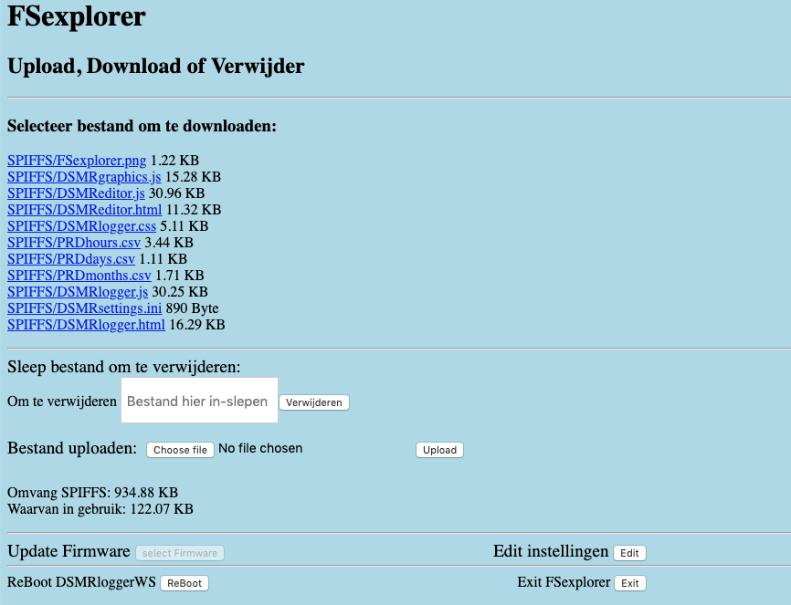

## Firmware naar ESP-01 Flashen

<div class="admonition note">
<p class="admonition-title">Let op!</p>
De DSMRloggerWS firmware is niet geschikt om, met alle functionaliteit, op
een ESP-01 te worden ge-upload. Daarvoor is de omvang van de firmware
eenvoudig te groot.<br>
Met een ESP-01(S) is het niet mogelijk om <b><i>Over The Air</i></b> updates van de
firmware of SPIFFS te doen.<br>
Ook de RTS hardware op voor de ESP-01 niet beschikbaar.
</div>

Om de firmware naar de ESP-01 (black Edition) te kunnen flashen moet deze eerst 
voor deze ESP-01 geschikt worden gemaakt.

Dit doen we door vóór de `#define`'s twee *slashes* (**//**) te zetten.
In de ArduinoIDE zien de regels na `/*** compiler options ***/` er dan
zó uit:

```
/******************** compiler options  ********************************************/
// #define IS_ESP12              // define if it's an ESP-12
// #define USE_ARDUINO_OTA       // define if there is enough memory
// #define HAS_OLED_SSD1306      // define if an OLED display is present
// #define HAS_NO_METER          // define if No "Slimme Meter" is attached
/******************** don't change anything below this line ************************/
```

Vervolgens moeten de [`Boards`] settings als volgt worden ingevuld:


Voor een ESP-01S moeten dezelfde instellingen worden gebruikt, alleen zit bij dit board
de "Builtin Led:" op `GPIO2`!

Stop de ESP-01 in de programmer 
([hier](https://willem.aandewiel.nl/index.php/2018/08/27/eenvoudige-programmer-voor-de-esp-01-esp8266/) 
vind je een post over hoe je van een USB to ESP-01
Adapter zelf eenvoudig een programmer kunt maken) en sluit deze aan op je computer.
Vergeet niet de juiste `Port` te selecteren en druk op het *Compile and Upload icoon*.


<br>

---
<center  style="font-size: 70%">[ScreenShot DSMR-FSexplorer]</center><br>

