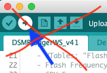
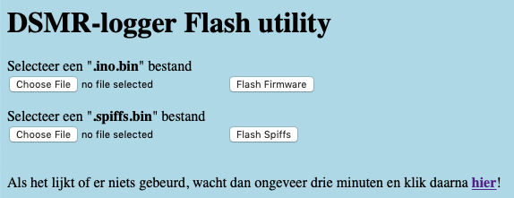
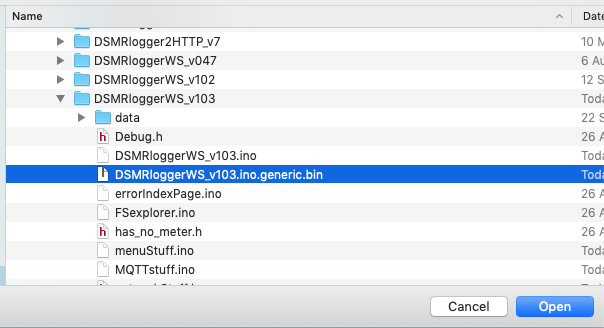
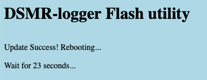

## Firmware Flashen naar DSMR-logger V4 board

Versie 4 van de DSMR-logger hardware maakt gebruik van een ESP-12
processor. Deze processor zit op de printplaat van de DSMR-logger
gesoldeerd en moet dus, op de printplaat, geflashed worden.

Om de firmware naar de **DSMRlogger Versie 4** te kunnen flashen moet deze eerst 
voor de ESP-12 geschikt worden gemaakt.

Dit doe je door in de ArduinoIDE de `#define`'s in het eerste tab-blad aan te passen.

Heb je géén Oled-display (let op de twee *slashes* voor alle `#define`'s behalve de eerste twee!):
```
/******************** compiler options  ********************************************/
#define IS_ESP12                  // define if it's a 'bare' ESP-12 (no reset/flash functionality on board)
#define USE_UPDATE_SERVER         // define if updateServer to be used and there is enough memory
//  #define HAS_OLED_SSD1306          // define if a 0.96" OLED display is present
//  #define HAS_OLED_SH1106           // define if a 1.3" OLED display is present
//  #define USE_PRE40_PROTOCOL        // define if Slimme Meter is pre DSMR 4.0 (2.2 .. 3.0)
//  #define USE_NTP_TIME              // define to generate Timestamp from NTP (Only Winter Time for now)
//  #define SM_HAS_NO_FASE_INFO       // if your SM does not give fase info use total delevered/returned
//  #define SHOW_PSK_KEY              // well .. show the PSK key, what else?
//  #define HAS_NO_METER              // define if No "Slimme Meter" is attached (*TESTING*)
/******************** don't change anything below this comment **********************/

```
Heb je wel een Oled-display op de DSMR-logger aangesloten dan moeten de compiler options
als volgt worden aangepast (twee *slashes* voor alle, behalve de eerste drie `#define`'s!):
```
/******************** compiler options  ********************************************/
#define IS_ESP12                  // define if it's a 'bare' ESP-12 (no reset/flash functionality on board)
#define USE_UPDATE_SERVER         // define if updateServer to be used and there is enough memory
#define HAS_OLED_SSD1306          // define if an OLED display is present
//  #define HAS_OLED_SH1106           // define if a 1.3" OLED display is present
//  #define USE_PRE40_PROTOCOL        // define if Slimme Meter is pre DSMR 4.0 (2.2 .. 3.0)
//  #define USE_NTP_TIME              // define to generate Timestamp from NTP (Only Winter Time for now)
//  #define SM_HAS_NO_FASE_INFO       // if your SM does not give fase info use total delevered/returned
//  #define SHOW_PSK_KEY              // well .. show the PSK key, what else?
//  #define HAS_NO_METER              // define if No "Slimme Meter" is attached (*TESTING*)
/******************** don't change anything below this comment **********************/

```

Vervolgens moeten de `Boards` settings als volgt worden ingevuld:

|   | Instelling        |Waarde|
|:-:|:------------------|:-----|
|   | Board             | "Generic ESP8266 Module" |
|   | Upload Speed      | "115200" |
|   | CPU Frequency     | "80MHz" |
|   | Flash Frequency   | "40MHz" |
|   | Flash Mode        | "DIO" of "DOUT (compatible)" |
|   | Flash Size        | "4M (1M SPIFFS)" |
|   | Crystal Frequency | "26MHz" |
|   | Reset Method      | "None" |
|   | Debug Port        | "Disabled" |
|   | Debug Level       | "None" |
|   | IwIP Variant      | "v2 Lower Memory" |
|   | VTables           | "Flash" |
|   | Exeptions         | "Disabled" |
|   | Builtin Led       | "2" |
|   | Erase Flash       | "Only Sketch"<br>(First Time: "All Flash Contents") |
|   | Port              | Bedraad: "Serial Port" |

<div class="admonition note">
<p class="admonition-title">Pas op!</p>
Als je de <b>Flash Mode</b> veranderd t.o.v. wat je gebruikt hebt voor de
firmware die nu in de DSMR-logger zit, dan kun je de firmware <b>niet</b>
OTA uploaden!!!
</div>


<hr>
### Firmware Bedraad Flashen
<div class="admonition note">
<p class="admonition-title">Pas op!</p>
Koppel de DSMR-logger los van de <i>Slimme Meter</i> vóórdat je de DSMR-logger
op de programmer aansluit!!
</div>

Sluit de 
<a href="../hardware_V4_Programmer/" target="_blank">USB->ESP12 programmer</a>
aan op de `Program`-header van de *DSMR-logger v4* 

1. Druk de `FLASH` knop in en houd deze ingedrukt
2. Druk op de `RESET` knop 
3. Laat de `RESET` knop los
4. Laat de `FLASH` knop los

De *DSMR-logger v4* staat nu in Flash-mode en blijft in die mode tot er gegevens vanaf
de programmer naar de DSMR-logger zijn overgebracht óf tot je nog een keer op de
`RESET` knop drukt.

Vergeet niet in de ArduinoIDE de `Port` te selecteren waarop je de USB->ESP12 
programmer hebt aangesloten en druk op het *Compile and Upload* icoon.


<hr>
### Firmware *Over The Air* Flashen
Bij het *Over The Air* flashen van de firmware of `data`-map kan de 
DSMR-logger v4 gewoon op de Slimme Meter aangesloten blijven.

Alle instellingen voor de DSMRloggerWS firmware blijven gelijk aan
de bedraade methode van flashen. 

Vervolgens moet je niet op het &nbsp; `Compile & Upload`-Icoon
&nbsp;  &nbsp;

klikken maar in het [`Sketch`] drop-down menu de keuze `Upload Compiled Binary` selecteren.

<center></center>

De firmware wordt nu gecompileerd en in de Arduino Sketch map waar de DSMRloggerWS firmware 
ook staat neergezet. Het bestand heeft de extentie `.bin`.

Als de firmware gecompileerd is klik je op de DSMR-logger pagina op het 
 icoontje.

In de FSexplorer klik je op de knop `select Firmware`

<center></center>

Er verschijnt nu een scherm waarin je een firmware bestand (de naam eindigt 
op `.bin` met ergens in de naam ook `.ino.`) kunt kiezen door op de bovenste knop `Choose File` te klikken. 


<center></center>

Selecteer uit het `popUp scherm` dat nu verschijnt het binary file dat je 
wilt uploaden ..

<center></center>

.. klik op <span style="background: blue; color:white;">[Choose]</span>
en daarna op de knop `flash Firmware`

<center></center>

Na enige tijd krijg je de melding dat de upload is geslaagd en dat de DSMR-logger
opnieuw opstart. 

<div class="admonition note">
<p class="admonition-title">Let op!</p>
Het komt regelmatig voor dat het scherm niet automatisch ge-refreshed wordt (dit
lijkt te maken te hebben met de omvang van de firmware). Klik
in dat geval, na ongeveer 3 minuten, op de tekst 
<br><br>
<span style="font-family: sans-serif;">
&nbsp; &nbsp; &nbsp; Als het lijkt of er niets gebeurd, wacht dan ongeveer drie minuten en klik daarna <b>hier</b>.
</span>
<br><br>
Als de verbinding met de server vóór die tijd verbroken wordt klik dan op de
`back` knop van de browser waarna de tekst alsnog (weer) verschijnt. Klik
nu op **hier** om de DSMRloggerWS hoofd pagina opnieuw te laden.
</div>


<br>

---
<center  style="font-size: 70%">[DSMR-PCB]</center><br>
<center></center>
