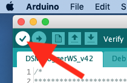

## Upload Over The Air (bug?)

Het lijkt erop dat er een bug zit in de toolchain van de ArduinoIDE
voor wat betreft het `Over The Air uploaden` van omvangrijke Firmware.

Als je probeert om de DSMRloggerWS firmware via de ArduinoIDE te
uploaden krijg je consequent een popUp window te zien waarin
gevraagd wordt een password in te voeren:


Waarna, *wat je ook klikt of invult* je de volgende foutmelding in
de ArduinoIDE te zien krijgt:


.. waarna het verhaal stopt.

Het popUp window is een bekend fenomeen in de Arduino wereld, maar 
er wordt nergens écht een oplossing gegeven.

Maar gelukkig ís er wél een oplossing!

Het blijkt, dat als je de instructie om de firmware te uploaden
naar de ESP8266 op de command line handmatig invoert de OTA
upload wél goed gaat!

Inplaats van op het `Compile & Upload` icon &nbsp;  &nbsp; te klikken 

moet je in de IDE op het `Verify` icon &nbsp;  &nbsp; klikken.

Daarná kun je in een `terminal` of `command` window het script `espota.py` gebruiken
om de gecompileerde binary naar de ESP8266 over te zetten.

In de `bin` directory van de repository heb ik een Python programma
gezet die dit nog iets eenvoudiger maakt.

#### otaUpload programma
Je roept het programma als volgt aan:
```
otaUpload <IP adres van de ESP8266>
```

Ga naar de map waar de gecompileerde firmware staat (je kunt deze
vinden in het bestand `preferences.txt`). Standaard is dit de submap
`build` in de `Sketch location`.


```
$  cd <Sketch location>/build
$  otaUpload 192.168.12.161
otaUpload : [ 1 ] [ DSMRloggerWS_v42.ino.bin ]
otaUpload : bin File Found  DSMRloggerWS_v42.ino.bin
otaUpload : Last Modified   Tue Apr 23 14:37:13 2019
----------------------------------------------------------------------------
otaUpload : espota -i  192.168.12.161  -f  DSMRloggerWS_v42.ino.bin
Uploading................................................................
.........................................................................
.........................................................................
Done ..
$ 
```

Om het programma in jouw omgeving te laten werken moet je een aantal regels
aanpassen.
```
#!/usr/local/bin/python
```
Dit is de `shebang` regel die aangeeft waar op jouw systeem python
geïnstalleerd is. Pas de regel zo aan dat het pad naar python
goed staat.

```
#------ this is the Sketch Location (see preferences.txt) --
BUILDPATH = "/Users/User/tmp/Arduino/build"

```
`BUILDPATH` is de variabele die aangeeft waar in jouw setup van de ArduinoIDE
de gecompileerde firmware wordt neergezet.

```
#------ Edit this ESPOTAPY to point to the location --------
#------ where your espota.py file is located        --------
ESPOTAPY  = '/Users/User/Library/Arduino15/packages/esp8266/hardware/esp8266/2.5.0/tools/espota.py'

```
De variabele `ESPOTA` geeft aan waar in jouw systeem het `espota.py` programma staat.

Als je de Sketch `BasicOTA` Over The Air upload naar een ESP8266 dan zie je in het
log-window onderin de ArduinoIDE een regel verschijnen die `espota.py` aanroept. 
```
Sketch uses 307352 bytes (29%) of program storage space. Maximum is 1044464 bytes.
Global variables use 28424 bytes (34%) of dynamic memory, leaving 53496 bytes for local variables. Maximum is 81920 bytes.
python /<path>/espota.py -i 192.168.12.161 -p 8266 --auth= -f /Users/WillemA/tmp/Arduino/build/BasicOTA.ino.bin 
Uploading............................................................................................
.....................................................................................................
.....................

```
Dit deel van de regel `/<path>/espota.py` moet je hier invullen.

Tenslotte moet je het `otaUpload` programma in een map/directory zetten die in de `PATH` variabele
staat.


### preferences.txt
Ergens in het `preference.txt` bestand staan deze instellingen die aangeven
waar je binaries worden neergezet.
```
build.path=/Users/User/tmp/Arduino/build
build.verbose=true
build.warn_data_percentage=75
```
